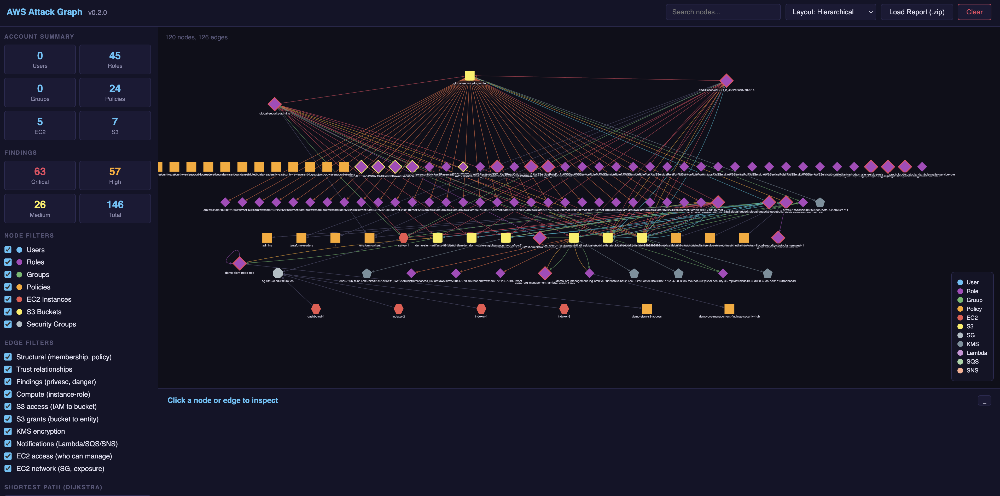
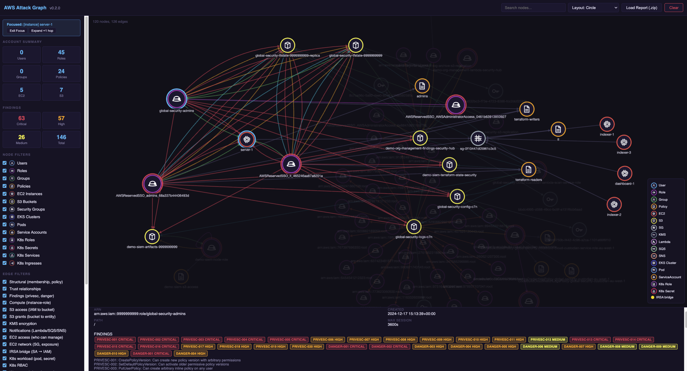
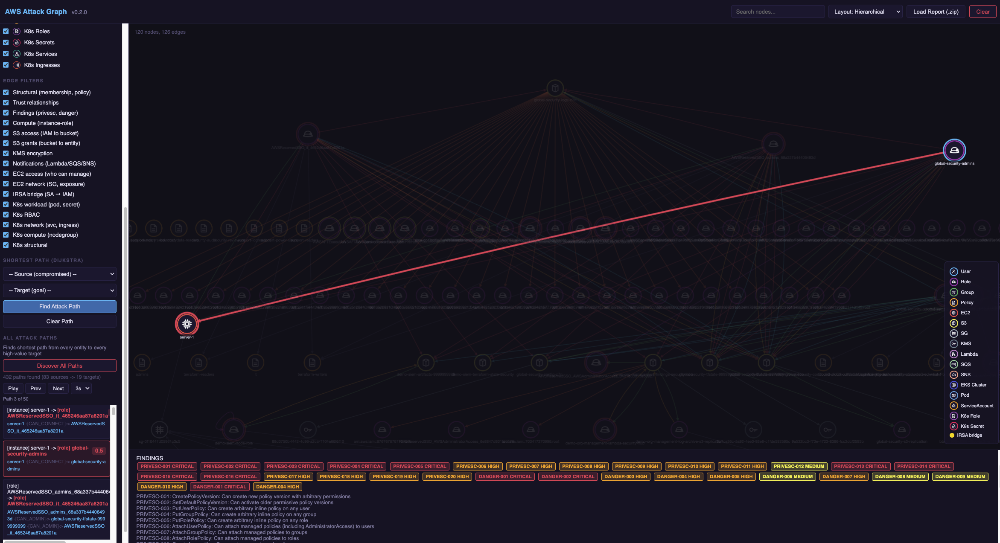

# AWS Enumerator

An AWS attack graph tool inspired by [BloodHound](https://github.com/BloodHoundAD/BloodHound). Enumerate AWS resources, analyze IAM policies for privilege escalation paths, map trust relationships, and visualize the attack surface through an interactive graph dashboard.

Built for **offensive security** and **assumed breach scenarios** &mdash; you have access to an AWS account or a set of AWS keys, and you need to understand what you can reach, what you can escalate to, and where the high-value targets are.

> This project is in **continuous development**. Features, parsers, and dashboard capabilities are actively being added.

---

## Features

### Enumeration
- **IAM** &mdash; Users (access keys, MFA, console access), roles (trust policies), groups, managed policies (full document content), inline policies, permission boundaries, account password policy
- **S3** &mdash; Buckets, policies, ACLs, public access blocks, versioning, encryption, tagging, logging, CORS, event notifications
- **EC2** &mdash; Instances with metadata, instance profiles, security groups, network interfaces, IMDS configuration
- **VPC** &mdash; VPCs, subnets, route tables, internet gateways, NAT gateways, NACLs, VPC endpoints, peering connections
- **Security Groups** &mdash; Rules with associated ENI/instance resources
- **CloudTrail, CloudFront, WAF, Flow Logs**

### Policy Analysis
- **20 privilege escalation detection rules** &mdash; CreatePolicyVersion, PassRole+Lambda, PassRole+EC2, PassRole+CloudFormation, AttachUserPolicy, CreateAccessKey, UpdateAssumeRolePolicy, and more
- **10 dangerous permission rules** &mdash; Wildcard admin, iam:*, s3:*, unrestricted PassRole, kms:Decrypt on *, etc.
- **Trust policy analysis** &mdash; Cross-account trust, wildcard principals, service trust
- **S3 resource relationships** &mdash; IAM-to-bucket access (CAN_READ, CAN_WRITE, CAN_ADMIN, FULL_ACCESS), bucket policy grants, public access detection, KMS encryption links, event notification targets
- **EC2 compute relationships** &mdash; Instance-to-role mapping, who can manage/terminate/connect to instances, security group exposure, IMDS vulnerability detection, SG-to-SG references

### Dashboard
- **Interactive attack graph** powered by Cytoscape.js with Dijkstra shortest path
- **Node types** &mdash; Users, roles, groups, policies, EC2, S3, security groups, KMS keys, Lambda, SQS, SNS
- **Weighted edges** for attack path cost modeling (direct access = 0, PassRole chains = 2, SSRF = 3, cross-account = 4)
- **Focus mode** &mdash; Click a node to isolate it and its relationships
- **Owned/compromised marking** &mdash; Flag nodes you control and find paths from them
- **"Discover All Paths"** &mdash; Auto-find every shortest path from every entity to every high-value target
- **Attack path playback** &mdash; Auto-play through discovered paths with adjustable speed
- **Resizable panels**, search, layout switching, node/edge filters
- Load reports via `.zip` file (drag & drop or file picker)

### Multi-Region
- `--all` flag enumerates all enabled regions (auto-discovered via `ec2:DescribeRegions`)
- Global services (IAM, S3, CloudFront) enumerated once; regional services per-region
- `--zip` flag packages reports for easy transport

---

## Quick Start

### Install via pipx (recommended)

```bash
pipx install git+https://github.com/0xj4f/aws-enumerator.git
```

Or install locally for development:

```bash
git clone https://github.com/0xj4f/aws-enumerator.git
cd aws-enumerator
pip install -e .
```

Then run:

```bash
aws-enumerator --region eu-west-2
aws-enumerator --all --zip
```

### Run with Docker

```bash
# With environment variables
docker run --rm \
  -e AWS_ACCESS_KEY_ID=$AWS_ACCESS_KEY_ID \
  -e AWS_SECRET_ACCESS_KEY=$AWS_SECRET_ACCESS_KEY \
  -e AWS_SESSION_TOKEN=$AWS_SESSION_TOKEN \
  -v $(pwd)/reports:/app/reports \
  0xj4f/aws-enumerator:latest --region eu-west-2

# With AWS credentials file
docker run --rm \
  -v ~/.aws:/root/.aws \
  -v $(pwd)/reports:/app/reports \
  0xj4f/aws-enumerator:latest --region eu-west-2 --zip
```

### Run directly (no install)

```bash
git clone https://github.com/0xj4f/aws-enumerator.git
cd aws-enumerator
pip install boto3
python app/main.py --region eu-west-2
```

---

## Usage

```
aws-enumerator [--region REGION] [--all] [--zip]
```

| Flag | Description |
|------|-------------|
| `--region` | AWS region to enumerate (default: `eu-west-2`) |
| `--all` | Enumerate all enabled regions |
| `--zip` | Create a zip archive of the report |

### Dashboard

After enumeration, open the dashboard and load your report:

```bash
open dashboard/index.html
```

Drop the `.zip` file onto the dashboard or click "Load Report".

**Visualize the hierarchy** &mdash; see how roles, policies, instances, and buckets connect across the account.



**Identify high-connectivity nodes** &mdash; find roles and entry points with the most relationships and exposure.



**Discover attack paths** &mdash; Dijkstra shortest path from any compromised node to high-value targets.



---

## Report Structure

### Single region
```
reports/{date}/{account}/{region}/
    iam/           # Users, roles, groups, policies, inline policies, policy documents
    s3/            # Buckets, policies, ACLs, encryption, notifications
    ec2/           # Instances
    vpc/           # VPCs, subnets, route tables, gateways
    sg/            # Security groups
    cloudtrail/    # Trails
    cloudfront/    # Distributions
    waf/           # WebACLs, rule groups, IP sets
    flowlogs/      # VPC flow logs
    analysis/      # findings.json, permission_map.json, trust_relationships.json,
                   # s3_relationships.json, ec2_relationships.json, summary.json
    manifest.json
```

### All regions (`--all`)
```
reports/{date}/{account}/
    global/        # IAM, S3, CloudFront, analysis
    us-east-1/     # Regional services
    eu-west-2/     # Regional services
    ...
    manifest.json
```

---

## AWS Credentials

This tool requires valid AWS credentials. Use any standard method:

```bash
# Assume a role
aws sts assume-role \
  --role-arn arn:aws:iam::ACCOUNT:role/ROLE_NAME \
  --role-session-name enum-session

# Export credentials
eval "$(aws configure export-credentials --format env)"

# Or use SSO
eval "$(aws-sso eval -S profile-name --profile profile-name)"
```

---

## Project Structure

```
aws-enumerator/
    app/
        main.py                  # CLI entry point
        components/
            iam.py               # IAM enumeration (enriched)
            s3.py                # S3 enumeration
            ec2.py               # EC2 enumeration
            vpc.py               # VPC enumeration
            sg.py                # Security groups
            cloudtrail.py        # CloudTrail
            cloudfront.py        # CloudFront
            waf.py               # WAF
            flowlogs.py          # Flow logs
            policy_parser.py     # Policy analysis & relationship engine
        utils/
            aws_utils.py         # Boto3 session helpers
            regions.json         # AWS regions reference
    dashboard/
        index.html               # Attack graph dashboard (single file)
    Dockerfile
    pyproject.toml
    requirements.txt
    LICENSE
```

